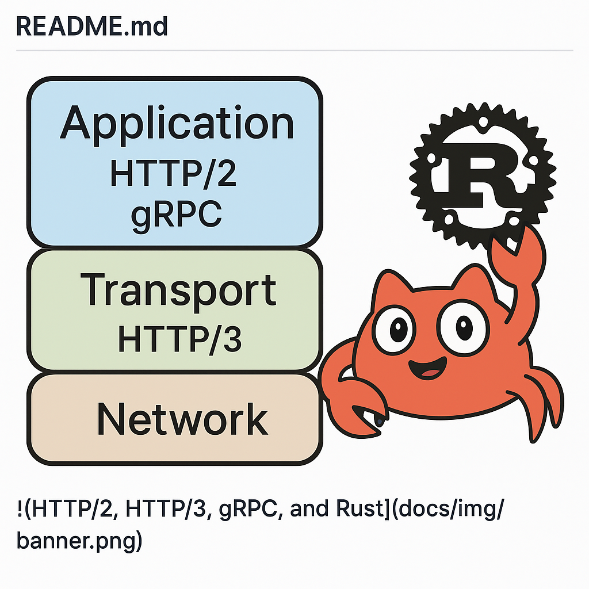

# Mini-Transport 🚀🦀

> **Rust playground** that shows how HTTP/2, HTTP/3 (QUIC) and gRPC work under the hood — all in ~600 LOC. Echo-client sends `hello →` — server answers `← world`.



<p align="center"><i>Layers, not magic: Application → Transport → Network. Ferris approves!</i></p>

---

## ✨ Features
* **Pure Rust** (edition 2021, stable 1.78) — zero C deps.
* Minimal **HTTP/2** frame encoder/decoder (DATA / HEADERS / SETTINGS).
* Tiny **gRPC** codec (5-byte prefix) — no codegen.
* Optional **QUIC / HTTP/3** server on UDP (quinn 0.11).
* Ready-to-run echo examples (`cargo run --example …`).

## 🗂 Project layout
```
mini-transport/
│  Cargo.toml         📦 deps: tokio, quinn, rcgen …
└─ src/
   ├─ h2/             🚌 low-level frames
   ├─ grpc/           📜 codec & echo service
   └─ h3/             🚀 QUIC wrapper (optional)
└─ examples/          👟 server.rs + client.rs
```

## 🚴‍♂️ Quick start
```bash
# 1. clone & build
$ git clone https://github.com/yourname/mini-transport.git
$ cd mini-transport
$ cargo build --release

# 2. run echo
$ cargo run --example server      # terminal 1
$ cargo run --example client      # terminal 2
response: world
```

## 🛠  How it works (TL;DR)
1. Client packs `hello` → gRPC message (flags+len+body).
2. Wraps it into HTTP/2 **DATA-frame**, writes to TCP.
3. Server reads frame, decodes gRPC, replies with `world` the same way.
4. QUIC version changes only the transport layer.

> Dive into code in [`src/`](./src/) — every module is 100-200 lines and heavily commented.

## 🔭 Roadmap
- [ ] HPACK/QPACK header compression
- [ ] Flow-control (WINDOW_UPDATE)
- [ ] ALPN + TLS for HTTP/2
- [ ] Streaming gRPC & trailers

PRs and issues are welcome — let’s make protocol internals less scary 😎

---
© 2025 Mini-Transport Digkill - MediaRise. MIT License.
